* * *
# README - conky
* * *

## Screenshots

* * *
### Scorpio - Fedora Core 15 (2012-2014)
* * *

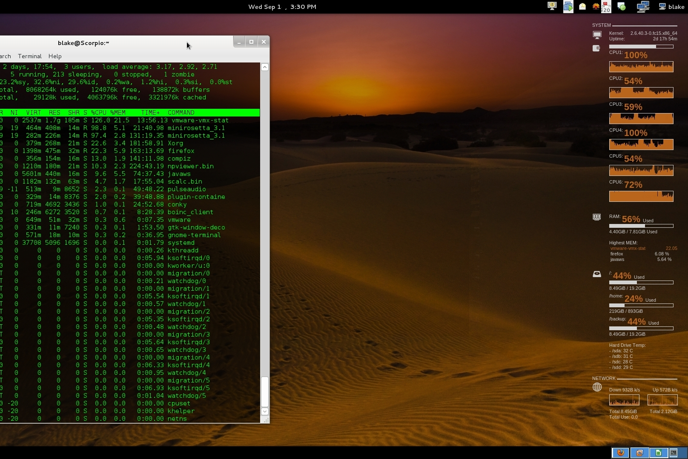

* * *
### Gemini - Fedora Core 20 (2013-2016)
* * *

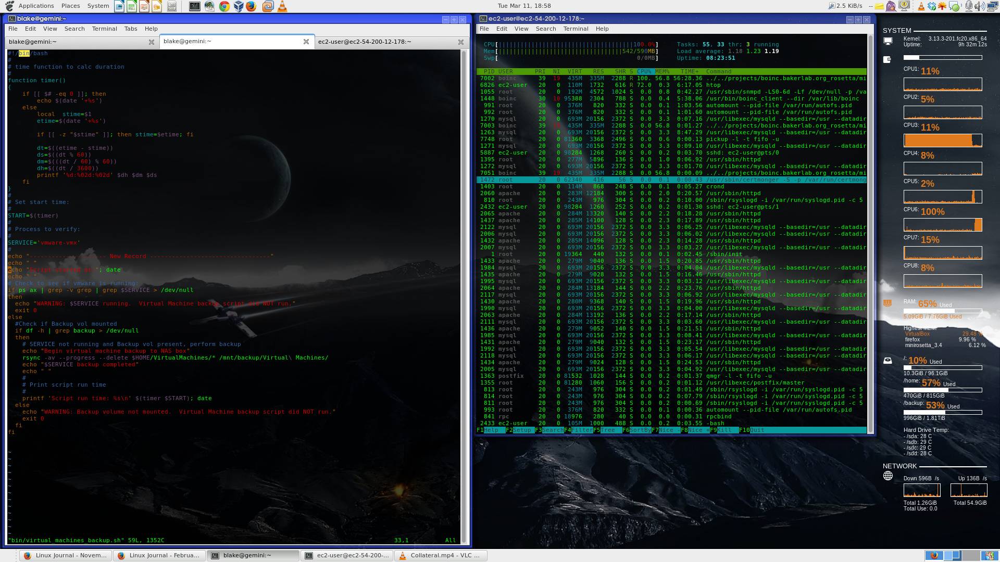

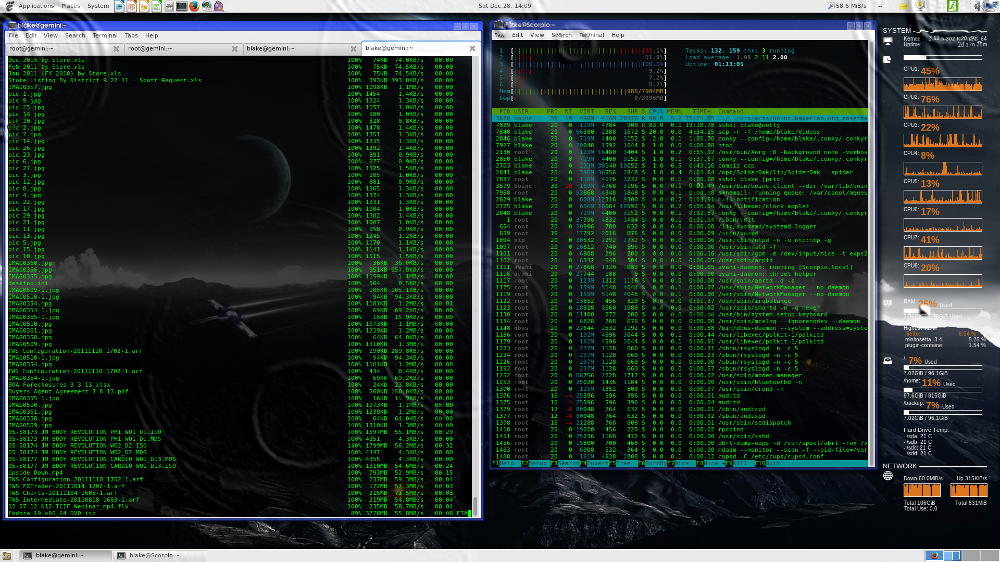

* * *
### Zion Laptop - Linux Mint 17.3 (2016-2017)
* * *

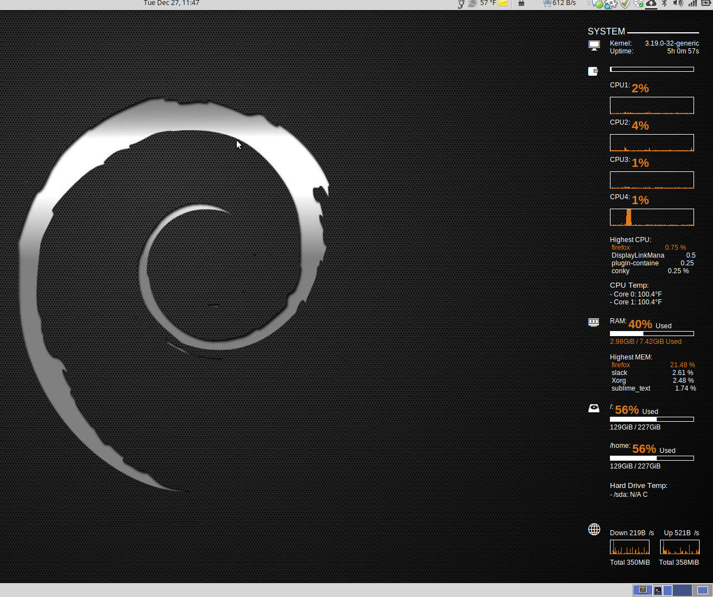

* * *
### Ubuntu1 - Ubuntu 16.10 (2H2017-2018)
* * *

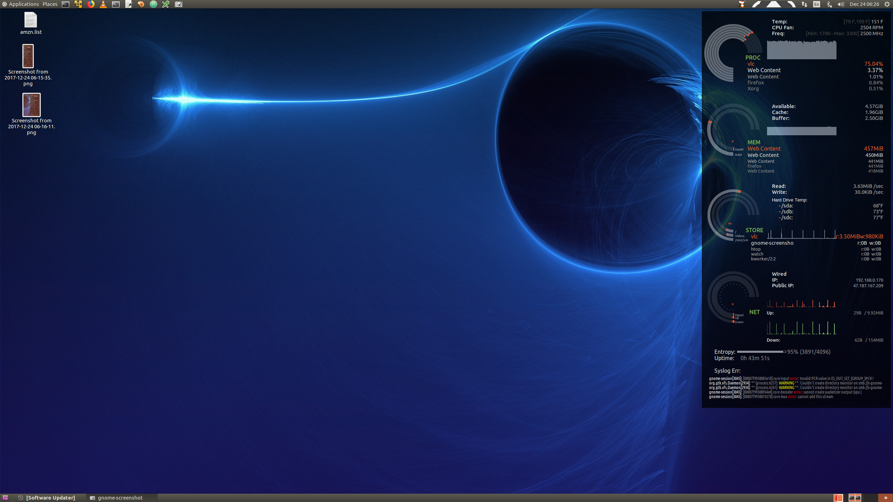

* * *
### Conky Setup -- ubuntu1 (2017-2018)
* * *

#### Desktop

[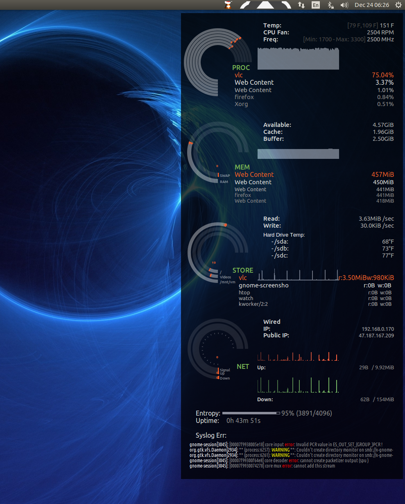](https://bitbucket.org/blakeca00/library-utilities/src/master/conky/assets/ubuntu1.png)

#### motd

[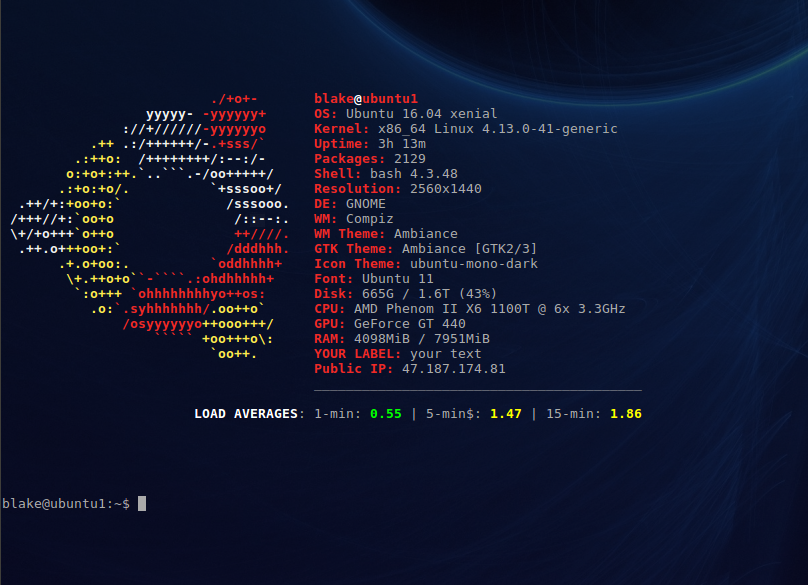](https://bitbucket.org/blakeca00/library-utilities/src/master/conky/assets/motd-ubuntu1.png)

* * *
### Scorpio - LMDE (2018)
* * *

[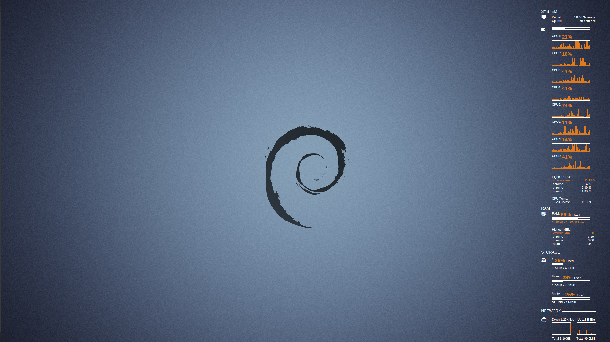](https://bitbucket.org/blakeca00/library-utilities/src/master/conky/assets/scorpio-desktop-2018.png)

* * *
### Conky Setup -- scorpio (2018)
* * *

[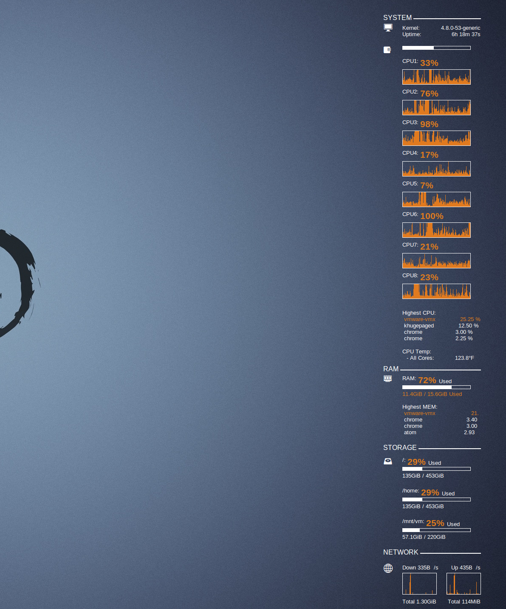](https://bitbucket.org/blakeca00/library-utilities/src/master/conky/assets/scorpio-detail.png)

* * *
### Conky Setup -- Libra XPS13 Developer Edition Laptop (2016 - 2019)
* * *

[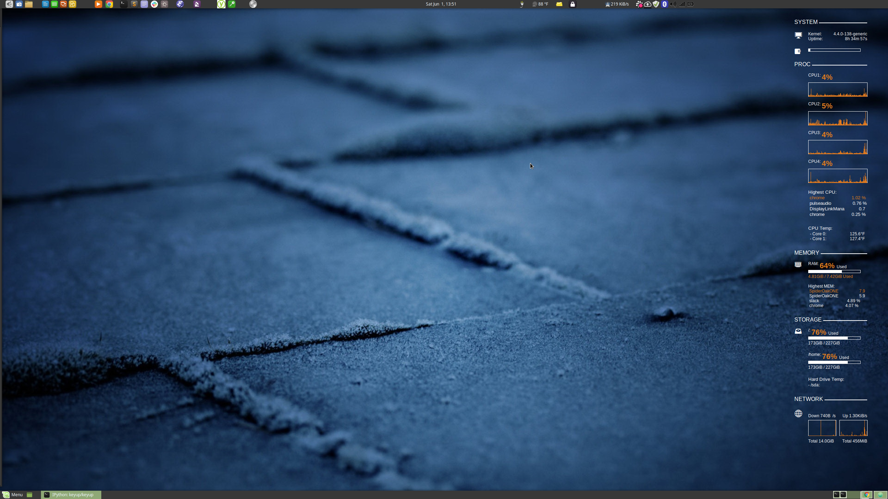](https://bitbucket.org/blakeca00/library-utilities/src/master/conky/assets/libra1.png)

[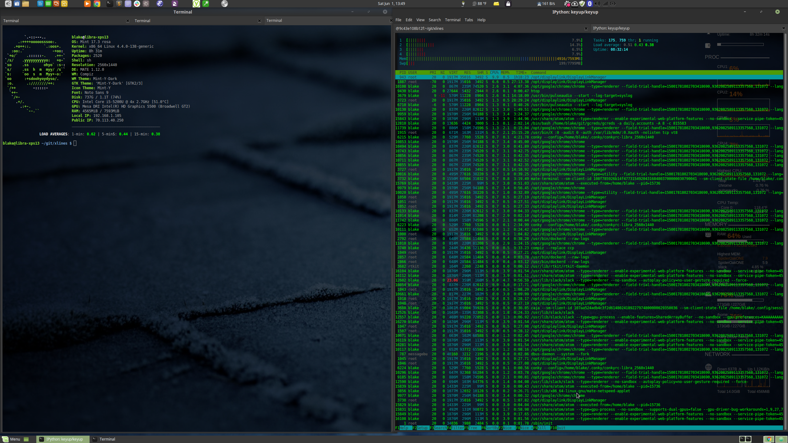](https://bitbucket.org/blakeca00/library-utilities/src/master/conky/assets/libra2.png)

[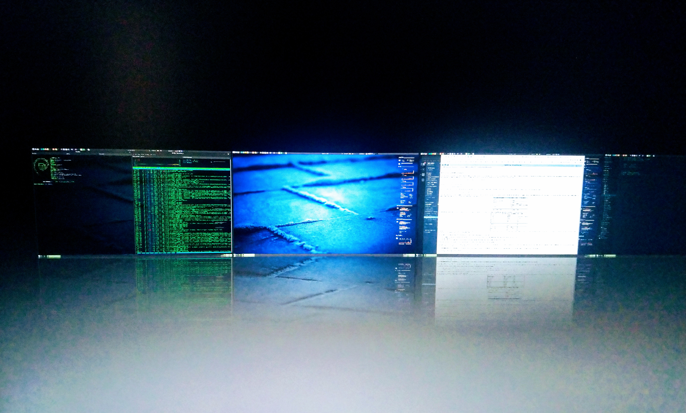](https://bitbucket.org/blakeca00/library-utilities/src/master/conky/assets/libra3.png)

* * *
### Conky Setup -- Ubuntu18.04 Desktop (ubuntu1-desktop, 2018 - 2020)
* * *

* Full Screen, `2560 x 1440` resolution.  [Zoom-in]("http://images.awspros.world/conky-configurations/ubuntu1-desktop2.png").

    <a href="http://images.awspros.world/conky-configurations/ubuntu1-desktop1.png" target="_blank">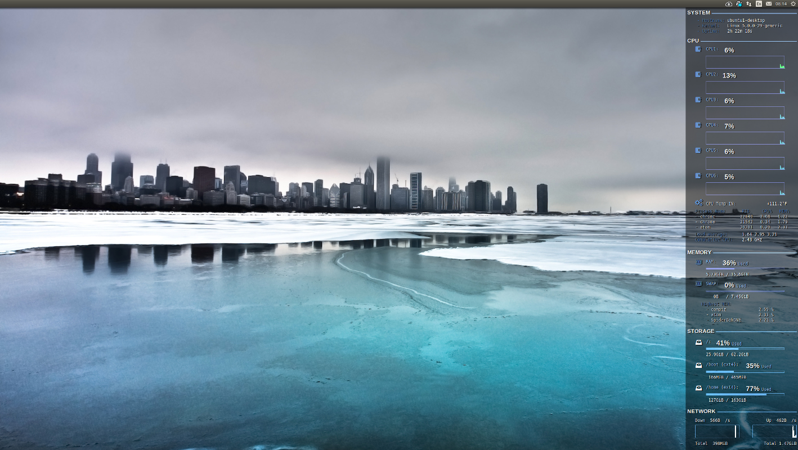

    <a href="http://images.awspros.world/conky-configurations/ubuntu1-desktop2.png" target="_blank">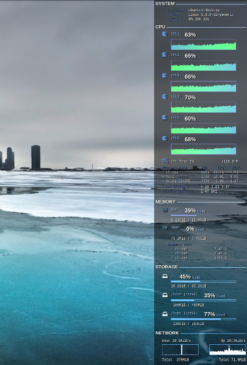

* * *
### Conky Setup -- Libra XPS13 Developer Edition Laptop (2019 - 2020)
* * *

    <a href="http://images.awspros.world/conky-configurations/2019-10_libra_conky.png" target="_blank">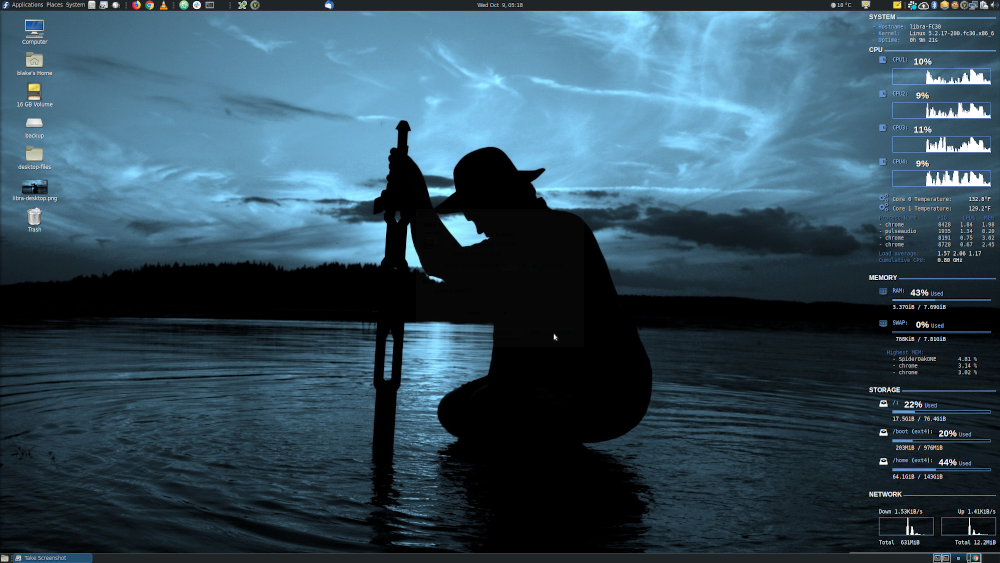

* * *

## conky file contents
