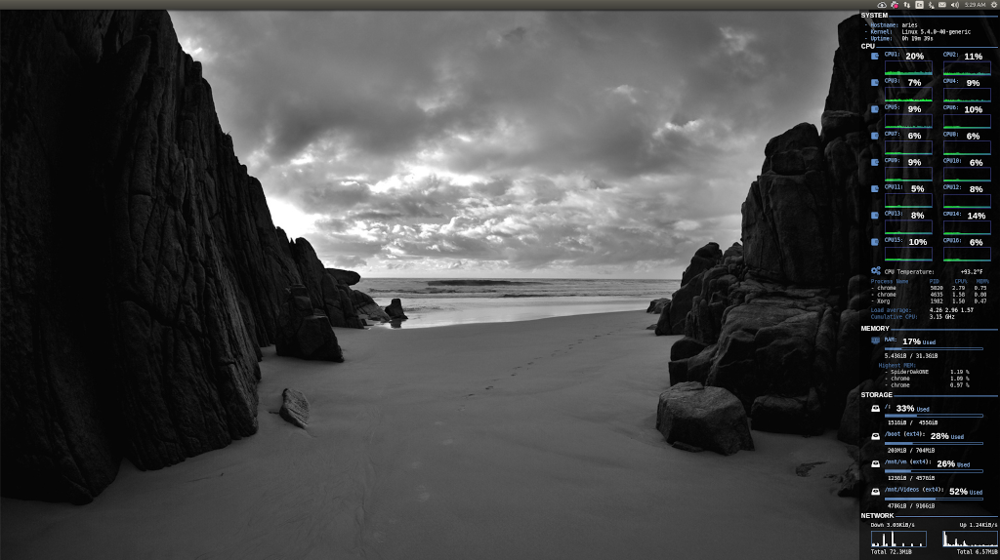
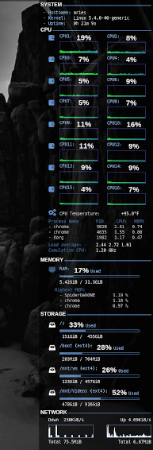

* * *
# README - conky
* * *

## Screenshots

* * *
### Scorpio - Fedora Core 15 (2012-2014)
* * *

--

[back to the top](#top)

* * *
### Gemini - Fedora Core 20 (2013-2016)
* * *

--

[back to the top](#top)

* * *
### Zion Laptop - Linux Mint 17.3 (2016-2017)
* * *

--

[back to the top](#top)

* * *
### Ubuntu1 - Ubuntu 16.10 (2H2017-2018)
* * *

--

[back to the top](#top)

* * *
### Conky Setup -- ubuntu1 (2017-2018)
* * *

#### Desktop

#### motd

--

[back to the top](#top)

* * *
### Scorpio - LMDE (2018)
* * *

--

[back to the top](#top)

* * *
### Conky Setup -- scorpio (2018)
* * *

--

[back to the top](#top)

* * *
### Conky Setup -- Libra XPS13 Developer Edition Laptop (2016 - 2019)
* * *

--

[back to the top](#top)

* * *
### Conky Setup -- Ubuntu18.04 Desktop (ubuntu1-desktop, 2018 - 2020)
* * *

* Full Screen, `2560 x 1440` resolution.  [Zoom-in](http://images.awspros.world/conky-configurations/ubuntu1-desktop2.png).

    <a href="http://images.awspros.world/conky-configurations/ubuntu1-desktop1.png" target="_blank">

--

[back to the top](#top)

* * *
### Conky Setup -- Libra XPS13 Developer Edition Laptop (2019 - 2020)
* * *

    <a href="http://images.awspros.world/conky-configurations/2019-10_libra_conky.png" target="_blank">

--

[back to the top](#top)

* * *
### Conky Setup -- Aries System 76 Thelio Desktop running Ubuntu 20.04 LTS (2020 - Current)
* * *

    <a href="http://images.awspros.world/conky-configurations/2020-07_ConkySetup_Aries_1.png" target="_blank">

    <a href="http://images.awspros.world/conky-configurations/2020-07_ConkySetup_Aries_2.png" target="_blank">

--

[back to the top](#top)

* * *
### Conky Setup -- Dell XPS 13 Developer Edition running Ubuntu 20.10 LTS (2021 - Current)
* * *

    <a href="http://images.awspros.world/conky-configurations/2021_libra-9310_Laptop.png" target="_blank">

    <a href="http://images.awspros.world/conky-configurations/2020-07_ConkySetup_Aries_2.png" target="_blank">

--

[back to the top](#top)

* * *

## Author & Copyright

All works contained herein copyrighted via below author unless work is explicitly noted by an alternate author.

* Copyright Blake Huber, All Rights Reserved.

[back to the top](#top)

* * *

## License

* Software contained in this repo is licensed under the [MIT license agreement](./LICENSE).

[back to the top](#top)

* * *

## Disclaimer

*Code is provided "as is". No liability is assumed by either the code's originating author nor this repo's owner for their use at AWS or any other facility. Furthermore, running function code at AWS may incur monetary charges; in some cases, charges may be substantial. Charges are the sole responsibility of the account holder executing code obtained from this library.*

Additional terms may be found in the complete [license agreement](./LICENSE).

[back to the top](#top)

* * *
